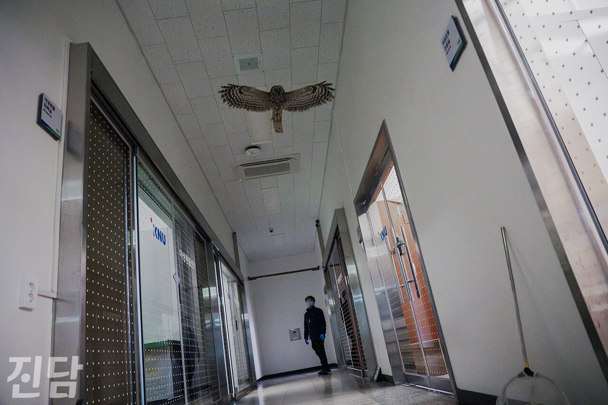
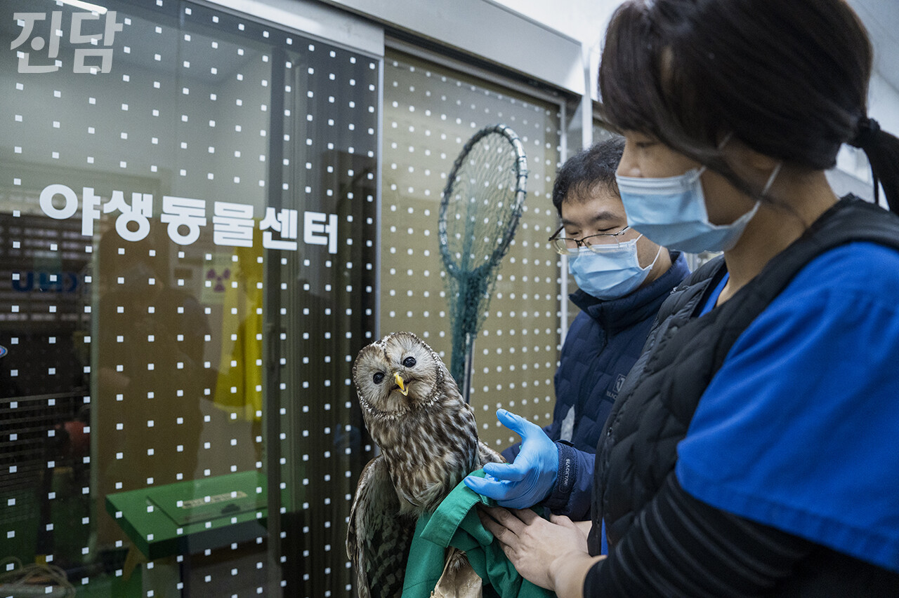

+++
title = '야생동물-인간 사이 최전방 근무'
date = 2024-03-11T11:06:00+09:00
categories = ["사회", "추천"]
tags = ["사회", "야생동물"]
keywords = ["야생동물"]
description = "야생동물 보호"
thumbnail = "1.jpg"
creator = "임은재 선임기자"
draft = false
+++

## 강원대 야생동물센터 수의사들을 만나다
<figure>
  
  <figcaption>긴점박이올빼미가 센터 복도에서 재활 치료의 일부인 비행 연습을 하고 있다.</figcaption>
</figure>

지난 1월 4일 춘천에 위치한 강원대학교 야생동물센터에서는 긴점박이올빼미의 비행 연습이 한창이었다. 수의사들과 직원들이 걱정스레 지켜보는 가운데 올빼미는 센터의 낮은 천장 아래를 제법 잘 날았다. 짧은 복도 끝과 끝을 오가다 이따금 횟대에 올라앉기도 했다. 곧 신우진·배소원(강원대 야생동물센터) 수의사가 긴 막대에 달린 포획망을 든 채 올빼미를 따라 복도를 가로질렀다.

긴점박이올빼미는 지난해 12월 28일 강원 강릉의 한 주택가에서 발견됐다. 유리창에 충돌해 출혈이 발생했지만 운 좋게 충돌을 목격한 시민에 의해 적절한 조치를 취할 수 있었다. “새들 입장에서는 유리창이 막혀 있다는 사실을 알 길이 없어요.” 신 수의사는 주택가에서 구조되는 새들의 상당수가 건물과의 충돌을 겪었다는 점을 강조했다. “유리창과 충돌한 새들은 죽거나 뼈가 부러져요. 운이 좋아 다시 날아가는 경우도 있지만 그 자리에서 즉사하는 경우도 허다하죠.”

<figure>
  
  <figcaption>긴점박이올빼미가 센터 복도에서 재활 치료의 일부인 비행 연습을 하고 있다.</figcaption>
</figure>

신우진·배소원 수의사가 비행 연습이 끝난 긴점박이올빼미를 붙잡은 채 강원대 야생동물센터 복도에 서 있다. 센터는 유리로 된 출입문을 새들이 막힌 공간으로 인지할 수 있도록 간격을 두고 점을 찍었다.

“얼굴이 정말 귀엽게 생겼죠?” 긴점박이올빼미를 붙잡은 배 수의사가 올빼미의 귀여운 외모를 칭찬했다. 배 수의사의 손에 붙들린 올빼미는 눈을 동그랗게 뜨고 기자를 바라봤다. 환자들과 정 들 법 하지 않냐는 물음에 신 수의사가 단호하게 대답했다. “되도록이면 정을 안 붙이려고 노력해요. 걔네(동물들)도 저희한테 정 없어요. 뒤도 안 돌아보고 떠나죠.” 신 수의사는 방생을 통한 이별이 가장 이상적인 결말이라고 말한다. 긴점박이올빼미도 센터에서 보름간의 치료와 재활을 마치고 야생으로 돌아갔다.

야생동물 수의사의 근무지는 야생동물-인간 사이의 ‘최전방’이다. 야생동물과의 첫만남은 대부분 사람들이 사는 곳 주변에서 이루어진다. 서식지에서 구조되는 일은 좀처럼 없다. 신고를 통해 접수된 야생동물들이 센터의 주 구조 대상이기 때문이다. 수의사들은 주택가·도로 등에서 부상당한 채 발견된 야생동물들을 치료하고 돌본다. “3:3:3이라고 보시면 됩니다. 30퍼센트는 구조 후 24시간 안에 죽어요. 30퍼센트는 안락사, 나머지 30퍼센트 정도만이 방생을 거쳐 야생으로 돌아가죠.” 신 수의사는 살 가망이 없거나 자연에서 살아가기 어려운 경우 어쩔 수 없이 안락사를 선택한다고 덧붙였다.

다치는 순간은 찰나지만 치료는 시간과 노력을 필요로 하는 고된 일이다. 재활이 길어지거나 타이밍이 나쁠 경우, 동물은 길게는 1년 이상을 좁은 센터 안에서 지내야만 한다. 영구 장애 등을 이유로 기약 없이 센터에 머물고 있는 동물도 있다. 해마다 수많은 동물이 개발·기후변화 등의 다양한 이유로 삶의 터전을 잃고 인가 주변을 떠돌다 부상당한다. 강원대 야생동물센터는 2010년대 중반부터 매 해 1,000마리 이상의 야생동물을 구조해 왔다. 실제로 2021년 센터에서 구조한 동물은 1,391마리다. 인간과 야생동물의 ‘불편한 동거’를 최전방에서 지켜보며, 신 수의사는 인간과 동물의 공존을 위한 노력이 지속되면 좋겠다고 소망한다. “인간 입장에서는 야생동물이 주택가에 침입했다고 여길 수 있겠지만 야생동물 입장에서 바라보면 그곳은 개발 이전부터 살아왔던 서식지라고 할 수 있으니까요.”

