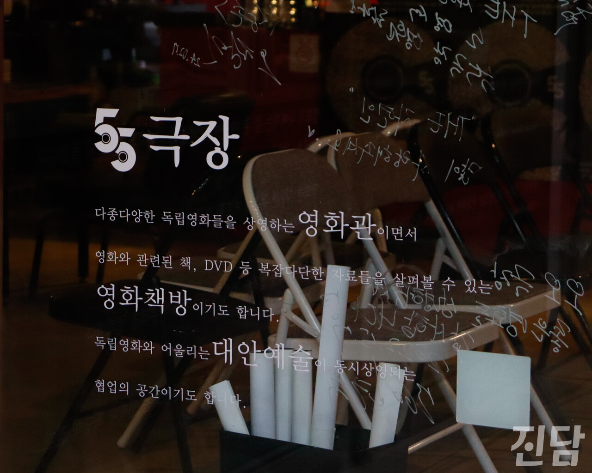
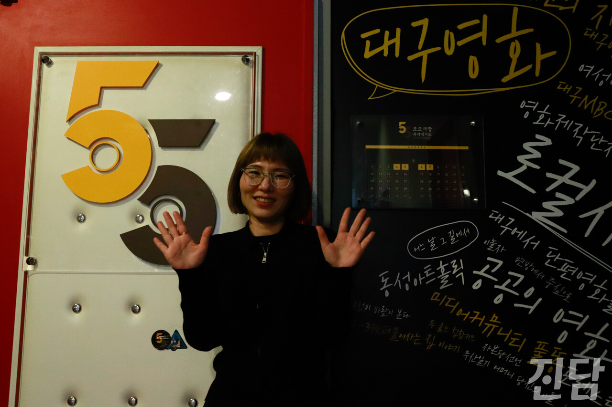

+++
title = "[취중진담] 오오극장이 알려주는 독립영화의 매력"
date = 2024-03-16T10:25:00+09:00
categories = ["취중진담"]
tags = ["대구", "오오극장", "독립극장", "독립영화"]
keywords = ["대구", "오오극장", "독립극장", "독립영화"]
description = ""
thumbnail = "1.jpg"
creator = "홍지원 기자"
draft = false
+++

<figure>
  
  <figcaption>오오극장의 입구에 위치한 삼삼다방. 투명한 유리는 오오극장을 다녀간 감독과 배우의 사인으로 채워져 있다. 홍지원 기자 ziwonzip@jindam.news 2024.02.18</figcaption>
</figure>

대구 중구에 있는 오오극장은 저녁 시간에도 관객들로 북적인다. 입구에 붙은 생소한 영화 포스터가 눈길을 끈다. “이런 영화도 있었어?” 하며 발걸음을 멈추게 하는 이곳은 ‘독립영화전용관’ 이다. 관은 하나, 좌석은 55개인 오오극장이 올해로 개관 9주년을 맞이했다. 9주년 특별전으로 진행된 GV가 끝나자마자 삼삼오오 모인 감독과 관객은 영화관을 한층 더 활기차게 만들었다. 한산한 극장에서 활기찬 극장이 되기까지 어떤 일이 있었을까. 오오극장의 9년, 노혜진 홍보팀장을 만나 그 시간을 톺아봤다.

**-오오극장을 개관하게 된 계기는** 
대구 시민들의 ‘다양한 영화를 볼 권리’를 보장하고, 지역 창작자들에게 상영의 기회를 제공하기 위해 개관했습니다. '영화관'하면 떠오르는 멀티 플렉스 영화관에서 비주류 영화는 사람들이 잘 오지 않는 시간대에 편성되고 빨리 내려가잖아요. 지역 영화인들 사이에서도 공간이 없어서 영화가 상영되지 못하는 문제를 해결해야 한다는 문제의식은 꾸준히 있었어요.

**-개관 예산 약 60% 시민 모금이었다고** 
홍보물을 만들어 대구의 여러 커뮤니티에 배포했어요. 대구 내 영화인뿐 아니라, 전국의 독립영화를 사랑하는 영화인 분들께서 개관까지 많이 도와주셨어요. 특히 서울에 위치한 독립영화전용관 '인디 스페이스'가 적극적으로 홍보를 해주셨죠.

**-오오극장이 주목받게 된 계기는.** 
처음 개관했을 때는 아무도 몰랐죠. 2015년 말, 한 관객분께서 ‘나쁜 나라’ 라는 영화를 많은 분들이 봤으면 좋겠다며 전석 티켓을 구매해 나눔하셨어요. 그게 전국적으로 이슈가 됐거든요. 그 일을 계기로 주목받기 시작했다고 생각해요.

**-일반 극장에 비해 상영리스트가 특별하다. 영화 상영 기준이 있는지.** 
한국 독립 영화를 주로 상영해요. 차별이나 편견의 요소가 있는 작품이 아니라면 개봉작은 가능하면 다 상영해요. 보통은 개봉작 상영 비율이 60% 정도 된다고 하는데 저희는 70% 정도로 많이 틀어요. 지역 영화관인 만큼 대구 독립 영화도 상영하고요. 상영 기간은 2주로 잡고 최대 14회 상영해요. 아무리 관객이 없더라도 기본적으로 지키는 내부 규정이에요.

**-오오극장만의 운영 철칙이 있다면.** 
시민들의 후원으로 만들어진 곳이니 공공의 영화관으로서 역할을 다할 책무가 있다고 생각해요. 그래서 시민들의 참여를 중요하게 생각하고 함께 할 수 있는 프로그램을 많이 기획하기 위해 노력합니다. 관객이 프로그래머가 돼 기획하는등 직접 참여의 기회도 열어두고 단체들과의 협업 활동도 많이 하려고 해요.

**-독립영화 유치가 지역 활성화에 영향을 미칠 수 있는지.**  
그럼요. 멀티플렉스 상영작은 분야가 한정돼 있어요. 사람들은 그것들이 영화의 전부라고 생각할 수도 있겠죠. 사실 그게 전부는 아닌데. 독립영화전용관이 필요한 이유이기도 해요. 세상에 존재하는 다양한 영화들을 접하면 상상력이 열리고, 사고가 확장되고, 보다 다채로운 시선으로 세상을 볼 수 있잖아요. 이런 생각을 하는 사람이 있구나, 하면서요. 그러다 보면 나의 세상도 열리는 거예요. 이러한 과정을 통해 확실히 풍성한 문화적 경험을 할 수도 있겠죠. 독립 영화는 그런 역할을 하는 것 같아요.

**-오오극장이 지역민의 문화생활에 어떤 역할을 했으면 하는지.** 
지역사회의 복합 문화 공간, 다양한 영화 문화가 꽃피는 공간, 관객과 친밀한 가까운 공간이면 좋겠어요. 독립 영화가 어렵다, 진지할거다... 이런 선입견이 큰 것 같아요. 저는 독립영화가 누구보다 빨리 현실을 반영하는 가장 트렌디한 영화라고 생각하거든요. 어려워하지 마시고 저희 독립영화와 오오극장에 관심 많이 가져주셨으면 좋겠습니다.

글·사진 : 홍지원 기자 ziwonzip@jindam.news. 

<figure>
  
  <figcaption>오오극장의 9년 중 8년을 함께 한 노혜진 씨가 인터뷰가 끝난 후 오오극장의 상영관 앞에서 ’55’ 포즈를 취하며 환하게 웃고 있다. 홍지원 기자 ziwonzip@jindam.news 2024.02.18</figcaption>
</figure>

